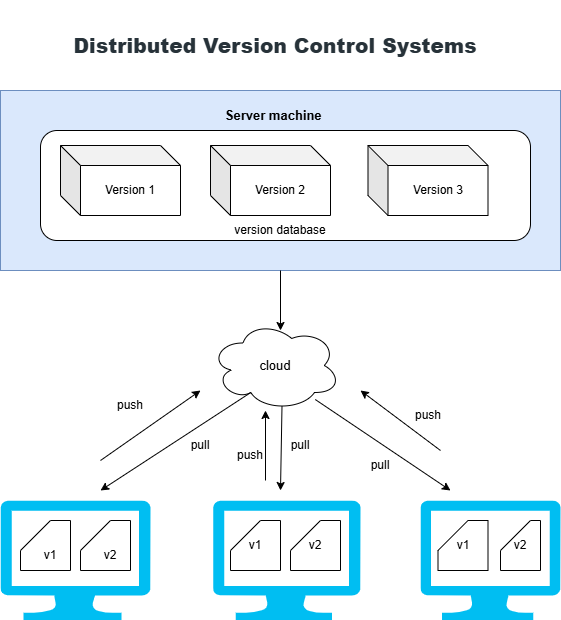

# What is version control system ?

It is also called **source code management**
system that records change to a file over time so that you can recall specific version later

# It allows you

- to revert file to a previous state.
- to revert entire project to pervios state
- to compare chnage oveer time

# Types of version control System

## 1. Local Version Control System

 

In this setup, you are the only contributor, and there is no collaboration or sharing of changes with other users. Each developer maintains their own isolated repository.

Characteristics:

- No internet or server dependency.
- Useful for individual projects.
- Limited to single-user environments.

Advantages:

- Automation

disadvantages:

- Data risk: data of file are within same system
- Non-shareable

---

## 2. Centralized Version Control Systems

---

In a Centralized Version Control System, all the files and their version history are stored in a single central server. Developers connect to this server to access or modify files.

## The typical workflow is:

- **Update/Checkout**: A developer pulls the latest version of the files from the central server.
- Make Changes: A developer works on the files.
- **Commit**: A developer saves ("commits") their changes directly back to the central server, making them immediately available to everyone else **(e.g. Rvcs [remote version control system]).**

---

## 3. Distributed Version Control Systems

Distributed version control systems contain multiple repositories. Each user has his or her own repository and working copy. Just committing your changes will not give others access to your changes. This is because a commit will reflect those changes in your local repository and you need to push them in order to make them visible to the central repository.

## The key difference is the two-step process for sharing changes:

- **Commit**: You save your changes to your own local repository. At this point, the changes are only on your machine; no one else can see them.
- **Push**: You upload ("push") your committed changes from your local repository to the central repository **(e.g., GitHub).**
